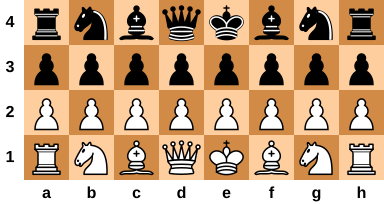
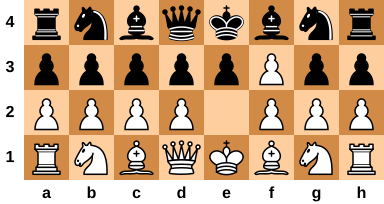
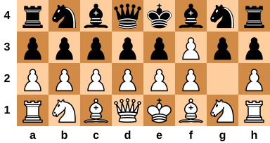
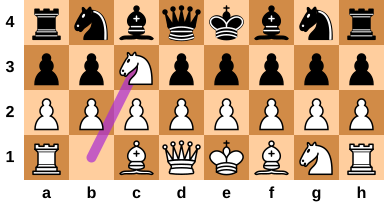
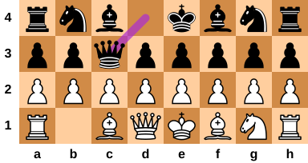
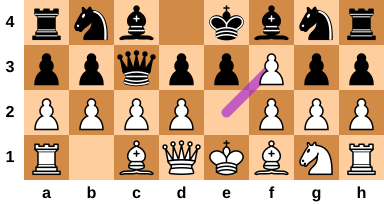
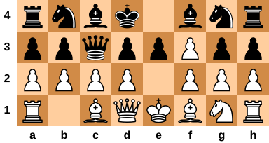
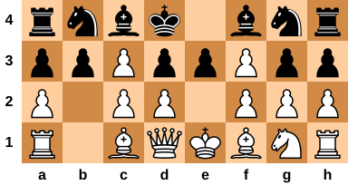
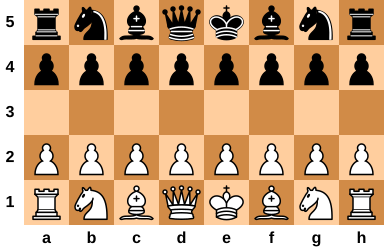

# Short Chess Mate Search

Brute-force mate search for ***short chess***: ordinary chess pieces and movement
on an 8-file board with 4 or more ranks.
The initial position is standard chess with middle ranks removed.
On a 4×8 board, this means every square is occupied by a piece.
On a 5×8 board, this leaves one empty rank between the pawn rows.

The program answers two questions for a number *n*:

- Can White, moving first, force checkmate in *n* White moves?
- After any White first move, can Black force checkmate in *n* Black moves?

The rules implemented are normal movement, check/checkmate, promotion, initial
two-square pawn moves, and en passant. Castling and draw rules are intentionally
omitted.

[Figures](figures) made with [SVG Tiler](https://github.com/edemaine/svgtiler).

## 4×8 Results

The 4×8 starting board is:



White has two immediate winning moves. Can you find them?

<details>
<summary>Show White's mate-in-1 moves</summary>

1\. White e2f3#



1\. White g2f3#



</details>

With `FORBID_TRIVIAL_4X8_WIN=1`, those two first moves are excluded and White
still has a unique winning first move for mate-in-3. Can you find it?

<details>
<summary>Show mate-in-3 strategy</summary>

1\. White b1c3



1\... Black d4c3 (only legal reply)



2\. White e2f3



2\... Black e4d4 (only legal reply)



3\. White b2c3#



</details>

## 5×8 Results

The 5×8 starting board is:



So far, this exhaustive search has confirmed that 5×8 chess has no winning
strategy for White or Black up to mate-in-9.

## Build and Run

```sh
make
./chess [depth|first..last] [transposition-table-mb]
```

The number of ranks is a compile-time option from 4 through 8:

```sh
make OPTIONS=-DBOARD_RANKS=4  # 4x8
make OPTIONS=-DBOARD_RANKS=5  # default 5x8
make OPTIONS=-DBOARD_RANKS=8  # ordinary 8x8 board, without castling
```

For 4×8, the two immediate winning first moves can be excluded from White's
initial move choice:

```sh
make OPTIONS="-DBOARD_RANKS=4 -DFORBID_TRIVIAL_4X8_WIN=1"
```

By default, transposition-table entries store two independent 64-bit
[Zobrist hashing](https://en.wikipedia.org/wiki/Zobrist_hashing) keys for
collision verification. To build the smaller one-key variant:

```sh
make OPTIONS=-DTT_DOUBLE_HASH=0
```

The one-key variant is less safe because a rare hash collision could confuse
two different positions, but it fits more transposition-table entries in the
same memory budget.

Examples:

```sh
./chess 5 8     # search just mate-in-5 with an 8 MB transposition table
./chess 1..5 8  # search mate-in-1, mate-in-2, ..., mate-in-5
./chess 6 0     # search just mate-in-6 with the transposition table disabled
```

If omitted, the depth range defaults to `1..5` and the transposition table
defaults to `8` MB.

## Main Optimizations

- Move ordering prioritizes checking moves, promotions, and high-value captures
  so failed branches are usually refuted earlier.
- A fixed-size transposition table caches exact search results for
  `(position, remaining moves)`. It uses
  [Zobrist hashing](https://en.wikipedia.org/wiki/Zobrist_hashing) and a
  configurable memory budget instead of trying to store every reachable
  position.
- Position state is updated incrementally during move making, including king
  locations, Zobrist keys, and color/piece bitboards.
- Move generation uses the bitboards to iterate directly over the side-to-move's
  pieces by type, while retaining a square array for simple destination lookups.
- Precomputed bit masks describe knight moves, king moves, pawn attacks, and
  sliding-piece rays from each square, reducing coordinate-loop work in move
  generation and check detection.
- Move generation uses fixed-capacity move lists to keep the recursive search
  allocation-free on its hot path.
